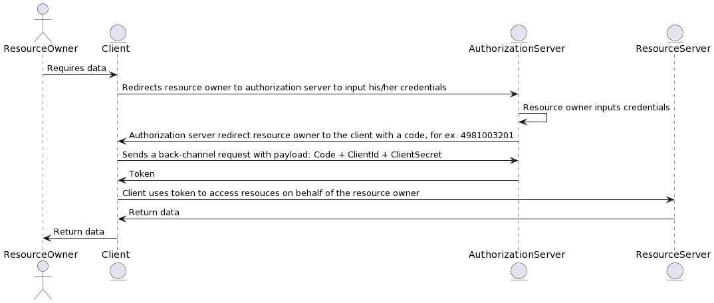
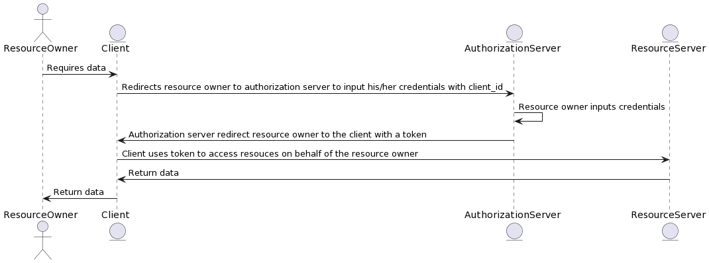
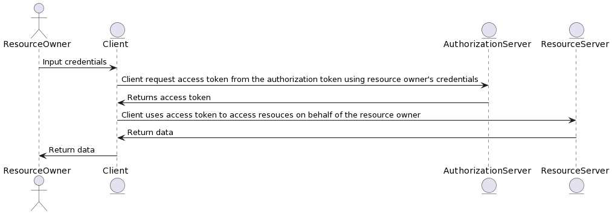
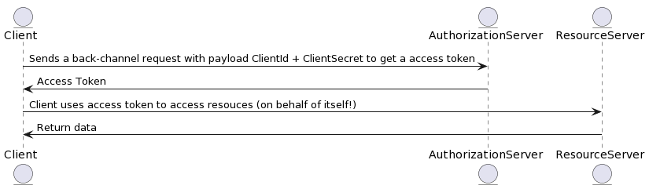
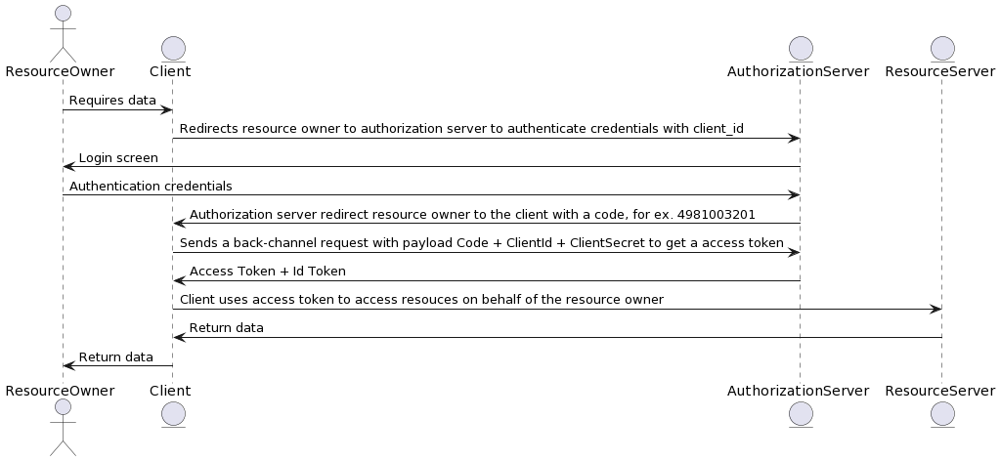
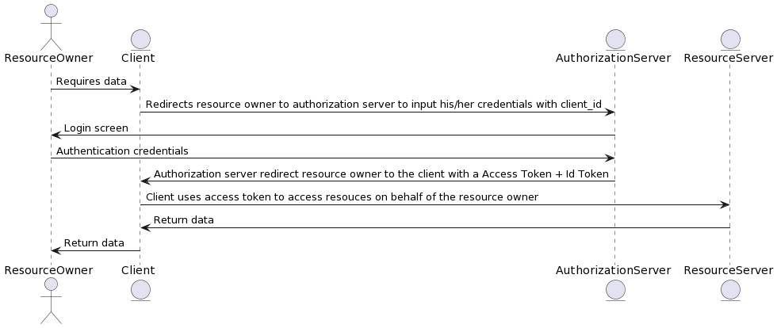
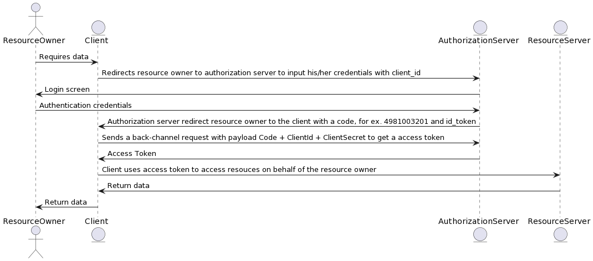
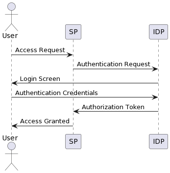
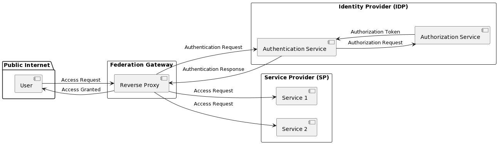
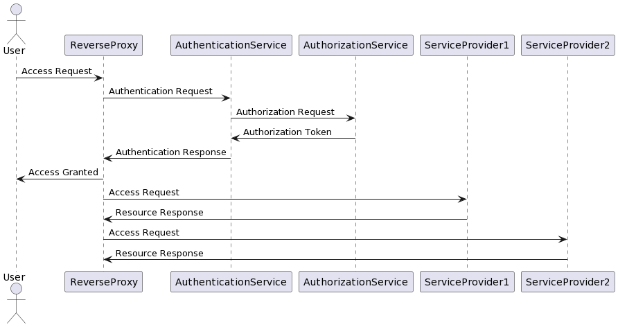

# OAuth2

## OAuth2 Authorization Flows

### Authorization Code Flow

- Grant Type: authorization_code
- Response Type: code

- Client does not have access to `resource owner`'s credentials
- Authorization server needs the resource owner's credentials to trust her/him, that's why client redirects resource owner to authorization server to input the credentials.
- Token does not returns back in redirects, token is issued by using client's request in back channel.
- ClientId and ClientSecret are sent using authorization headers in base64 format.
- For more info, see [Access Token Request / RFC 6479](https://datatracker.ietf.org/doc/html/rfc6749#section-4.1.3)

### Authorization Implicit Flow

> This flow is deprecated

- Grant Type: implicit
- Response Type: token

- This flow is desined for client's with type public (non-confidential) like JavaScript or native applications.
- Client does not have access to `resource owner`'s credentials

### Resource Owner Password Credentials Flow (ROPC)

> This flow is deprecated

- Grant Type: password
- Response Type: token

- This flow is designed for trusted clients! for example, facebook app is a trusted client for facebook itself! 
- Client **has access** to `resource owner`'s credentials

### Client Credentials Flow

- Grant Type: client_credentials
- Response Type: token

- In client credentials flow, the user does not have any role!
- Client should be a confidential client, otherwise, it will have security issues

## OpenID Connect Authorization Flows

- OIDC flows are all extensions of OAuth2 flows
- In the context of OpenID Connect (OIDC), the `openid` scope is a required scope that must be included in the authentication request in order to use OIDC for user authentication.
- In the context of OpenID Connect (OIDC), the `profile` is optional scope, but it should to request additional profile information like name, family, etc.

### Authorization Code Flows

- Grant Type: authorization_code
- Response Type: code id_token
- Required Scopes: openid profile

### Authorization Implicit Flow

- Grant Type: implicit
- Response Type: token id_token
- Required Scopes: openid profile
  
### Authorization Hybrid Flow

- Hybrid is combination of code flow and implicit flow
- In hybrid flow, user authenticates, then authorization server sends code and for example id_token in redirect response, the frontchannel could use id_token, but to get a access_token, it should send a backchannel request to the authorization server

- Grant Type: hybrid
- Response Types:
  - **code id_token** (Recommended)
  - code token
  - code id_token token
- Required Scopes: openid profile

## Federation Gateway

## OAuth2 and OpenID Protocols' Terminologies 

| Terminology | Definition |
| --- | --- |
| Access Token | A token that is issued by the authorization server to the client after the resource owner has granted authorization. The token is used by the client to access protected resources on behalf of the resource owner. |
| Authorization Code | A code that is issued by the authorization server to the client after the resource owner has granted authorization. The code is exchanged by the client for an access token. |
| Authorization Server | A server that issues access tokens to the client after the resource owner has granted authorization. |
| Backchannel | Backchannel protocols are used to communicate between services without requiring user interaction. In OAuth2 and OpenID Connect, backchannel protocols are used to communicate access tokens and other security information between the client, the authorization server, and the resource server. |
| Client | An application that requests access to a protected resource on behalf of the resource owner. |
| Frontchannel | Frontchannel protocols are used to facilitate user authentication and consent flows in OAuth2 and OpenID Connect. Frontchannel protocols typically involve user interactions with a web browser or mobile app, and are used to obtain user consent for accessing protected resources. |
| Grant Type | A type of OAuth2 authorization flow that defines the way in which the client can obtain an access token. Common grant types include Authorization Code, Implicit, Resource Owner Password Credentials, and Client Credentials. |
| Identity Provider | A server that provides authentication and authorization services to the client. |
| JSON Web Token (JWT) | A compact, URL-safe means of representing claims to be transferred between two parties. JWTs are used as access tokens in OAuth2 and OpenID Connect. |
| OpenID Connect (OIDC) | A protocol built on top of OAuth2 that adds authentication capabilities. OIDC allows the client to verify the identity of the end user based on the authentication performed by the identity provider. |
| Resource Owner | An entity that is capable of granting access to a protected resource. In OAuth2, the resource owner is typically the end user. |
| Resource Server | A server that hosts protected resources and that is capable of accepting and responding to protected resource requests using access tokens. |
| Scope | A string that specifies the level of access that the client is requesting. Scopes are used by the authorization server to determine the extent of access that the client is granted. |
| Security Token Service (STS) | An STS is a web service that issues security tokens, which are used to authenticate and authorize access to protected resources. STSs are commonly used in federated identity scenarios, where users need to access resources across multiple security domains or organizations. |
| Token Endpoint | The endpoint on the authorization server that the client uses to exchange an authorization code for an access token. |
| User | An entity that interacts with a system or application, typically through a user interface. In the context of authentication and authorization, a user is typically someone who is authenticated by an identity provider and is granted access to resources based on their identity and associated permissions. |
| Userinfo Endpoint | The endpoint on the identity provider that the client uses to retrieve information about the authenticated user. |

## Notes
- Audience of the access token is not the client, but the server owner
- Audience of the id token is the client
- Relying party is the application who relies on IDP, it does not have any authentication/authorization but relies on IDP