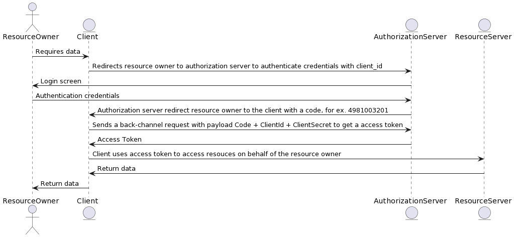

# OAuth2

## Authorization Flows

### Authorization Code Flow

- Client does not have access to `resource owner`'s credentials
- Authorization server needs the resource owner's credentials to trust her/him, that's why client redirects resource owner to authorization server to input the credentials.
- Token does not returns back in redirects, token is issued by using client's request in back channel.
- ClientId and ClientSecret are sent using authorization headers in base64 format.
- For more info, see [Access Token Request / RFC 6479](https://datatracker.ietf.org/doc/html/rfc6749#section-4.1.3)

### Authorization Implicit Flow

