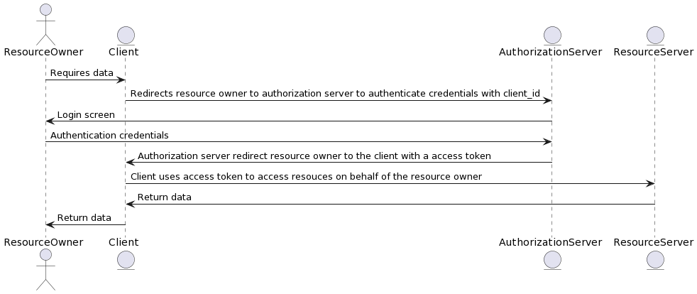

# OAuth2

## Authorization Flows

### Authorization Code Flow

- Client does not have access to `resource owner`'s credentials
- Authorization server needs the resource owner's credentials to trust her/him, that's why client redirects resource owner to authorization server to input the credentials.
- Token does not returns back in redirects, token is issued by using client's request in back channel.
- ClientId and ClientSecret are sent using authorization headers in base64 format.
- For more info, see [Access Token Request / RFC 6479](https://datatracker.ietf.org/doc/html/rfc6749#section-4.1.3)

### Authorization Implicit Flow

> This flow is deprecated

- This flow is desined for client's with type public (non-confidential) like JavaScript or native applications.
- Client does not have access to `resource owner`'s credentials

### Resource Owner Password Credentials Flow (ROPC)

> This flow is deprecated

- This flow is designed for trusted clients! for example, facebook app is a trusted client for facebook itself! 
- Client **has access** to `resource owner`'s credentials

### Client Credentials Flow

- In client credentials flow, the user does not have any role!
- Client should be a confidential client, otherwise, it will have security issues

## Federation Gateway

## OAuth2 and OpenID Protocols' Terminologies 

| Terminology | Definition |
| --- | --- |
| Access Token | A token that is issued by the authorization server to the client after the resource owner has granted authorization. The token is used by the client to access protected resources on behalf of the resource owner. |
| Authorization Code | A code that is issued by the authorization server to the client after the resource owner has granted authorization. The code is exchanged by the client for an access token. |
| Authorization Server | A server that issues access tokens to the client after the resource owner has granted authorization. |
| Client | An application that requests access to a protected resource on behalf of the resource owner. |
| Grant Type | A type of OAuth2 authorization flow that defines the way in which the client can obtain an access token. Common grant types include Authorization Code, Implicit, Resource Owner Password Credentials, and Client Credentials. |
| Identity Provider | A server that provides authentication and authorization services to the client. |
| JSON Web Token (JWT) | A compact, URL-safe means of representing claims to be transferred between two parties. JWTs are used as access tokens in OAuth2 and OpenID Connect. |
| OpenID Connect (OIDC) | A protocol built on top of OAuth2 that adds authentication capabilities. OIDC allows the client to verify the identity of the end user based on the authentication performed by the identity provider. |
| Resource Owner | An entity that is capable of granting access to a protected resource. In OAuth2, the resource owner is typically the end user. |
| Resource Server | A server that hosts protected resources and that is capable of accepting and responding to protected resource requests using access tokens. |
| Relying Party | An entity that relies on an identity provider to authenticate users and provide claims about those users. In other words, a relying party is a client that trusts the identity provider to authenticate its users. |
| Scope | A string that specifies the level of access that the client is requesting. Scopes are used by the authorization server to determine the extent of access that the client is granted. |
| Token Endpoint | The endpoint on the authorization server that the client uses to exchange an authorization code for an access token. |
| Userinfo Endpoint | The endpoint on the identity provider that the client uses to obtain information about the authenticated end user. |

## Notes
- Audience of the access token is not the client, but the server owner
- Audience of the id token is the client
- Relying party is the application who relies on IDP, it does not have any authentication/authorization but relies on IDP